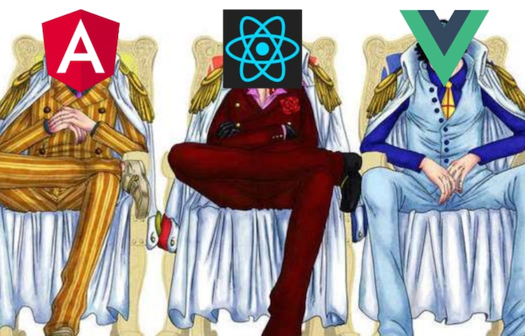
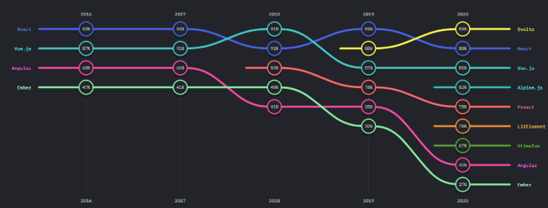
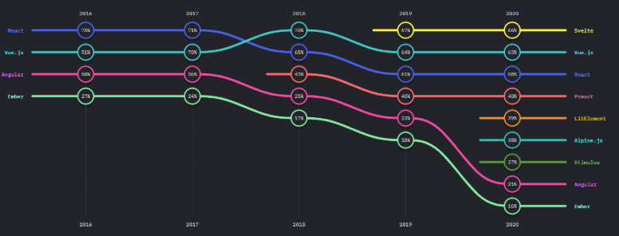
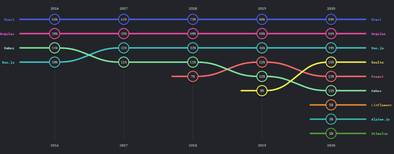
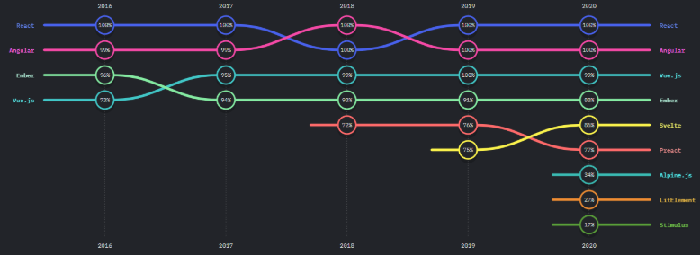
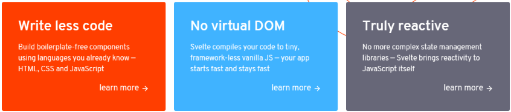
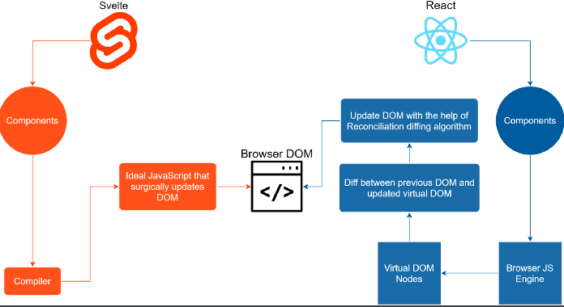

# 스벨트 vs 리액트

## 프론트엔드 프레임워크




## 스벨트

- Satisfaction



- Interest
  
- Usage
  
- Awareness




- 

- 2016년 출시 - Rich Harris 개발

- 현재 사용 하는 곳 - 뉴욕 타임스, 어베스트, 스포티파이, SEM러시, 체스 등

- 코드 간결, 가상 돔 x, 진짜 반응성
  

- 프론트앤드 프레임워크라고 하지만 - 컴파일러에 가깝다 -> 용량 작음

- ```shell
  npx degit sveltejs/template my-svelte-project
  cd my-svelte-project
  npm install
  npm run dev
  ```

- | 장점                                 | 단점                                            |
  | ------------------------------------ | ----------------------------------------------- |
  | 속도가 매우 빠르다                   | 커뮤니티 규모가 작다.                           |
  | 개발 속도 빠름 (코드 양이 적고 간결) | 자료가 별로 없음                                |
  | 용량이 작다                          | 런타임에서 동작하기 때문에 CDN 으로 제공 불가   |
  |                                      | 비표준적인 모습들 {#each} or {#if} 등등         |
  |                                      | 쓸데없는 라이브러리 포함? 트랜지션 애니메이션등 |

- 

- |           | 스벨트                                                       | 리액트                                                       |
  | --------- | ------------------------------------------------------------ | ------------------------------------------------------------ |
  |           | 컴파일러: 컴파일 후 빌드 -> 순수 자바스크립트 상태가 됨 -> 전체 소스코드도 적고 파일도 작아서 가볍고 빠름, 빌드 타임에 코드 해석 | 프레임워크: 빌드시 리액트 관련 툴을 함께 받아야됨, 런타임에 코드 해석 |
  | 지원      | 개발자 단체                                                  | 페이스북                                                     |
  | 기업 채택 | 위험                                                         | 안정적                                                       |
  | 속도      | 매우 빠름 ( 거의 바닐라JS 수준)                              | 빠름                                                         |
  | 가상돔    | 사용 X                                                       | 사용                                                         |
  | 반응성    | this.setState 혹은 Hook 을 사용                              | 반응성 매우 쉽게 해결 $                                      |
  | 크기      | 42 kb                                                        | 1.6 kb                                                       |
  | 진입장벽  | 더 쉽다 ( JSX 없고, 코드 간결, 여러가지 이미 내장되어 있음)  | 쉽다 - 다른 기능은 따로 라이브러리를 찾아서 가져와야됨       |

- 

## 코드 비교

- 기본

```jsx
import React from "react";

const Hello = () => {
  let name = "World";
  return <h1>Hello {name}!</h1>;
};

export default Hello;
```

```html
<script>
  let name = "World";
</script>

<h1>Hello {name}!</h1>
```

- 속성 (Dynamic attributes)

```jsx
import React from "react";

const Hello = () => {
    let src = "tutorial"
    return 
}
```

```html
<script>
	let src = '/tutorial/image.gif';
</script>


```

- InnerHtml

```jsx
import React from "react";

const Hello = () => {
    let string = `here's some <strong>HTML!!!</strong>`;
    return <div dangerouslySetInnerHTML={{ __html: string }}></div>
}
```

```html
<script>
	let string = `here's some <strong>HTML!!!</strong>`;
</script>

<p>{@html string}</p>
```

- Reactive

```jsx
import React, { useState } from "react";

const Hello = () => {
  const [count, setCount] = useState(0);

  function handleClick() {
    setCount((prev) => prev + 1);
  }
  return (
    <button onClick={handleClick}>
      Clicked {count} {count === 1 ? "time" : "times"}
    </button>
  );
};

export default Hello;
```

```html
<script>
	let count = 0;

	function handleClick() {
		count += 1;
	}
</script>

<button on:click={handleClick}>
	Clicked {count} {count === 1 ? 'time' : 'times'}
</button>
```

- reactive reactive

```js
import React, { useState, useEffect } from "react";

const Hello = () => {
  const [count, setCount] = useState(1);
  const [doubled, setDoubled] = useState(count * 2);
  const [quadrupled, setQuadrupled] = useState(doubled * 2);

  useEffect(() => {
    setDoubled(count * 2);
    setQuadrupled(doubled * 2);
  }, [count, doubled]);

  function handleClick() {
    setCount((prev) => prev + 1);
  }

  return (
    <>
      <button onClick={handleClick}>Count: {count}</button>
      <p>
        {count} * 2 = {doubled}
      </p>
      <p>
        {doubled} * 2 = {quadrupled}
      </p>
    </>
  );
};

export default Hello;
```

```jsx
<script>
	let count = 1;

	// the `$:` means 're-run whenever these values change'
	$: doubled = count * 2;
	$: quadrupled = doubled * 2;

	function handleClick() {
		count += 1;
	}
</script>

<button on:click={handleClick}>
	Count: {count}
</button>

<p>{count} * 2 = {doubled}</p>
<p>{doubled} * 2 = {quadrupled}</p>
```

- Reactive statements

```js
import React, { useState, useEffect } from "react";

const Hello = () => {
  const [count, setCount] = useState(1);

  useEffect(() => {
    if (count >= 10) {
      alert(`count is dangerously high!`);
      setCount(9);
    }
  }, [count]);

  function handleClick() {
    setCount((prev) => prev + 1);
  }

  return (
    <>
      <button onClick={handleClick}>Count: {count}</button>
    </>
  );
};

export default Hello;
```

```html
<script>
	let count = 0;

	$: if (count >= 10) {
		alert(`count is dangerously high!`);
		count = 9;
	}

	function handleClick() {
		count += 1;
	}
</script>

<button on:click={handleClick}>
	Clicked {count} {count === 1 ? 'time' : 'times'}
</button>
```

- props, default props, spread props

```js
// Hello.js
import React from "react";
import Children from "./Children";

const Hello = () => {
  const pkg = {
    name: "react",
    version: 3,
    speed: "blazing",
    website: "https://react.dev"
  };
  return (
    <>
      <Children answer={42} />
      <Children {...pkg} />
    </>
  );
};

export default Hello;


// Children.js
import React from "react";

const Children = ({ answer, name, version, speed, website }) => {
  return (
    <>
      <p>The answer is {answer}</p>
      <p>
        info: {name}, {version}
      </p>
    </>
  );
};

Children.defaultProps = {
  answer: "답 없음"
};

export default Children;

```

```html
<!-- App.svelte -->
<script>
	import Nested from './Nested.svelte';
    
    const pkg = {
		name: 'svelte',
		version: 3,
		speed: 'blazing',
		website: 'https://svelte.dev'
	};
</script>

<Nested answer={42}/>
<Nested {...pkg}/>

<!-- Nested.svelte -->
<script>
	export let answer = '답 없음';
</script>

<p>The answer is {answer}</p>
<p>info: {name}, {version}</p>
```

- logic if

```js
import React from "react";

const Hello = () => {
  const x = 7;

  return (
    <>
      {x > 10 ? (
        <p>{x} is greater than 10</p>
      ) : x < 5 ? (
        <p>{x} is less than 5</p>
      ) : (
        <p>{x} is between 5 and 10</p>
      )}
    </>
  );
};

export default Hello;
```

```html
<script>
	let x = 7;
</script>

{#if x > 10}
	<p>{x} is greater than 10</p>
{:else if 5 > x}
	<p>{x} is less than 5</p>
{:else}
	<p>{x} is between 5 and 10</p>
{/if}
```

- each

```jsx
import React from "react";

const Hello = () => {
  const cats = [
    { id: "J---aiyznGQ", name: "Keyboard Cat" },
    { id: "z_AbfPXTKms", name: "Maru" },
    { id: "OUtn3pvWmpg", name: "Henri The Existential Cat" }
  ];
  return (
    <>
      {cats.map((cat, i) => (
        <li key={i}>
          {i + 1}: {cat.name}
        </li>
      ))}
    </>
  );
};

export default Hello;

```

```html
<script>
	let cats = [
		{ id: 'J---aiyznGQ', name: 'Keyboard Cat' },
		{ id: 'z_AbfPXTKms', name: 'Maru' },
		{ id: 'OUtn3pvWmpg', name: 'Henri The Existential Cat' }
	];
</script>

<h1>The Famous Cats of YouTube</h1>

<ul>
	{#each cats as { id, name }, i (i)}
		<li>
			<a>
				{i + 1}: {name}
			</a>
		</li>
	{/each}
</ul>

```

- await

```js
import React, { useState, useEffect } from 'react';
import axios from 'axios';

function Users() {
  const [users, setUsers] = useState(null);
  const [loading, setLoading] = useState(false);
  const [error, setError] = useState(null);

  useEffect(() => {
    const fetchUsers = async () => {
      try {
        // 요청이 시작 할 때에는 error 와 users 를 초기화하고
        setError(null);
        setUsers(null);
        // loading 상태를 true 로 바꿉니다.
        setLoading(true);
        const response = await axios.get(
          'https://jsonplaceholder.typicode.com/users'
        );
        setUsers(response.data); // 데이터는 response.data 안에 들어있습니다.
      } catch (e) {
        setError(e);
      }
      setLoading(false);
    };

    fetchUsers();
  }, []);

  if (loading) return <div>로딩중..</div>;
  if (error) return <div>에러가 발생했습니다</div>;
  if (!users) return null;
  return (
    <ul>
      {users.map(user => (
        <li key={user.id}>
          {user.username} ({user.name})
        </li>
      ))}
    </ul>
  );
}

export default Users;
```

```html
<script>
	let promise = getRandomNumber();

	async function getRandomNumber() {
		const res = await fetch(`/tutorial/random-number`);
		const text = await res.text();

		if (res.ok) {
			return text;
		} else {
			throw new Error(text);
		}
	}

	function handleClick() {
		promise = getRandomNumber();
	}
</script>

<button on:click={handleClick}>
	generate random number
</button>

{#await promise}
	<p>...waiting</p>
{:then number}
	<p>The number is {number}</p>
{:catch error}
	<p style="color: red">{error.message}</p>
{/await}
```

- event

```jsx
import React, { useState } from "react";

const Hello = () => {
  const [m, setM] = useState({
    x: 0,
    y: 0
  });

  const style = {
    width: "100%",
    height: "500px"
  };

  function handleMousemove(event) {
    setM({
      x: event.clientX,
      y: event.clientY
    });
  }
  return (
    <div style={style} onMouseMove={handleMousemove}>
      The mouse position is {m.x} x {m.y}
    </div>
  );
};

export default Hello;
```

```html
<script>
	let m = { x: 0, y: 0 };

	function handleMousemove(event) {
		m.x = event.clientX;
		m.y = event.clientY;
	}
</script>

<div on:mousemove={handleMousemove}>
	The mouse position is {m.x} x {m.y}
</div>

<style>
	div { width: 100%; height: 100%; }
</style>
```

- event modifiers

```jsx
? 스벨트에서 좋은 기능인거 같다^^
```

```html
<script>
	function handleClick() {
		alert('no more alerts')
	}
</script>

<button on:click|once={handleClick}>
	Click me
</button>
```

# 결론

스벨트도 좋지만 그래도 리액트를 쓰는게 더 좋다고 생각합니다^^

가볍고 작고 간단한 프로젝트에서는 한번쯤 써볼만 합니다~

(타입스크립트도 지원합니다. 아직은 몇몇 부분에서는 불안정하다고 하는 사람도 있음)